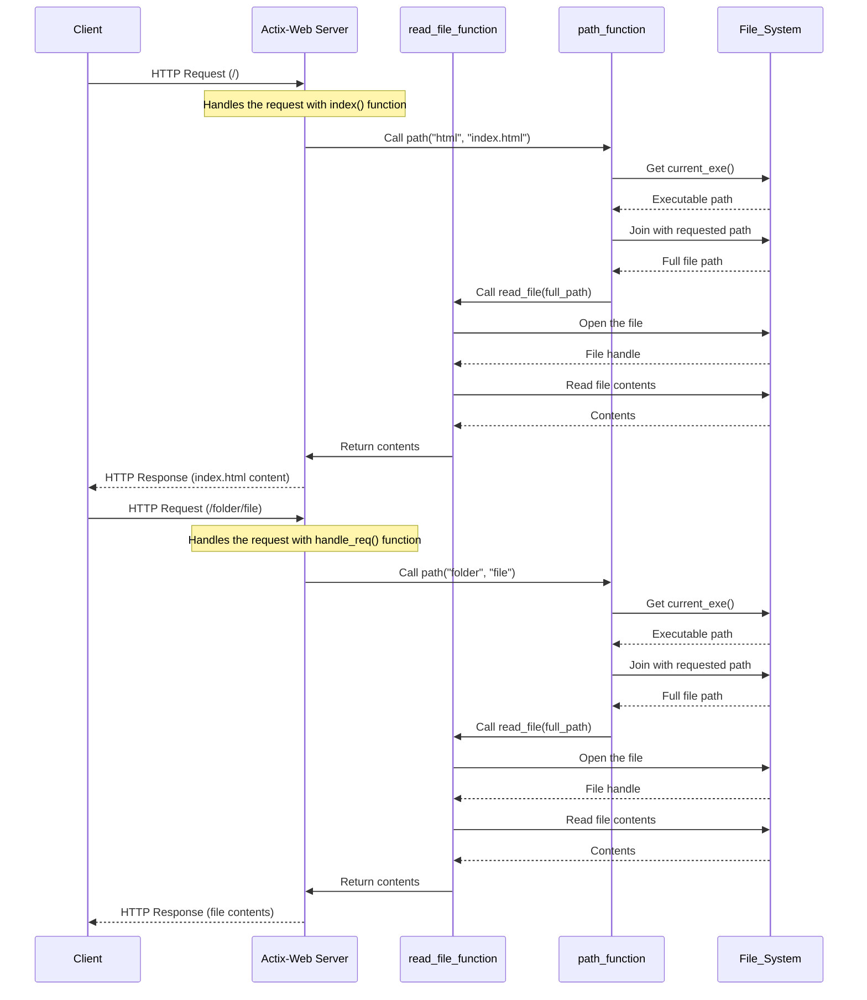

```mermaid
sequenceDiagram
    participant Client
    participant Actix-Web Server
    participant read_file_function
    participant path_function
    participant File_System

    Client ->> Actix-Web Server: HTTP Request (/)
    Note over Actix-Web Server: Handles the request with index() function

    Actix-Web Server ->> path_function: Call path("html", "index.html")
    path_function ->> File_System: Get current_exe()
    File_System -->> path_function: Executable path
    path_function ->> File_System: Join with requested path
    File_System -->> path_function: Full file path
    path_function ->> read_file_function: Call read_file(full_path)
    read_file_function ->> File_System: Open the file
    File_System -->> read_file_function: File handle
    read_file_function ->> File_System: Read file contents
    File_System -->> read_file_function: Contents
    read_file_function ->> Actix-Web Server: Return contents

    Actix-Web Server -->> Client: HTTP Response (index.html content)

    Client ->> Actix-Web Server: HTTP Request (/folder/file)
    Note over Actix-Web Server: Handles the request with handle_req() function

    Actix-Web Server ->> path_function: Call path("folder", "file")
    path_function ->> File_System: Get current_exe()
    File_System -->> path_function: Executable path
    path_function ->> File_System: Join with requested path
    File_System -->> path_function: Full file path
    path_function ->> read_file_function: Call read_file(full_path)
    read_file_function ->> File_System: Open the file
    File_System -->> read_file_function: File handle
    read_file_function ->> File_System: Read file contents
    File_System -->> read_file_function: Contents
    read_file_function ->> Actix-Web Server: Return contents

    Actix-Web Server -->> Client: HTTP Response (file contents)
```