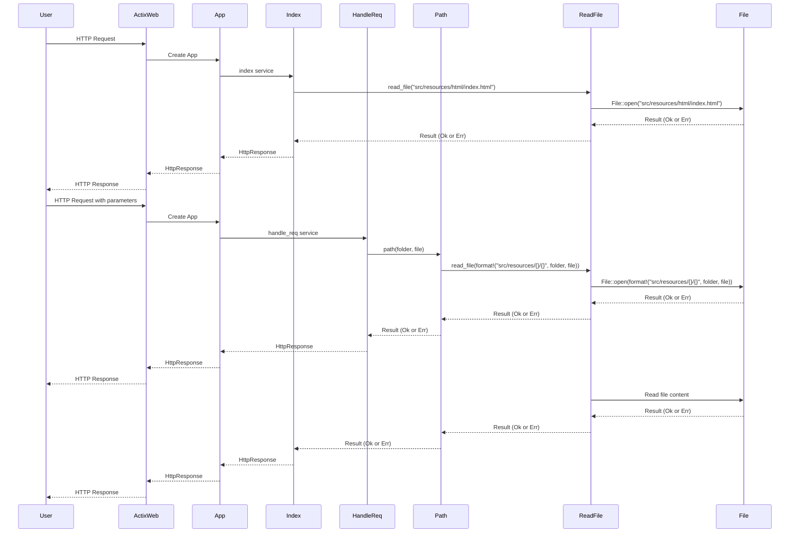

```mermaid
sequenceDiagram
    participant User
    participant ActixWeb
    participant App
    participant Index
    participant HandleReq
    participant Path
    participant ReadFile

    User->>ActixWeb: HTTP Request
    ActixWeb->>App: Create App
    App->>Index: index service
    Index->>ReadFile: read_file("src/resources/html/index.html")
    ReadFile->>File: File::open("src/resources/html/index.html")
    File-->>ReadFile: Result (Ok or Err)
    ReadFile-->>Index: Result (Ok or Err)
    Index-->>App: HttpResponse
    App-->>ActixWeb: HttpResponse
    ActixWeb-->>User: HTTP Response

    User->>ActixWeb: HTTP Request with parameters
    ActixWeb->>App: Create App
    App->>HandleReq: handle_req service
    HandleReq->>Path: path(folder, file)
    Path->>ReadFile: read_file(format!("src/resources/{}/{}", folder, file))
    ReadFile->>File: File::open(format!("src/resources/{}/{}", folder, file))
    File-->>ReadFile: Result (Ok or Err)
    ReadFile-->>Path: Result (Ok or Err)
    Path-->>HandleReq: Result (Ok or Err)
    HandleReq-->>App: HttpResponse
    App-->>ActixWeb: HttpResponse
    ActixWeb-->>User: HTTP Response

    ReadFile->>File: Read file content
    File-->>ReadFile: Result (Ok or Err)
    ReadFile-->>Path: Result (Ok or Err)
    Path-->>Index: Result (Ok or Err)
    Index-->>App: HttpResponse
    App-->>ActixWeb: HttpResponse
    ActixWeb-->>User: HTTP Response
```